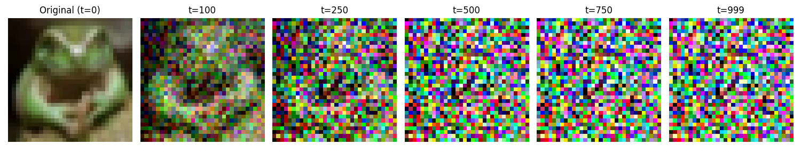
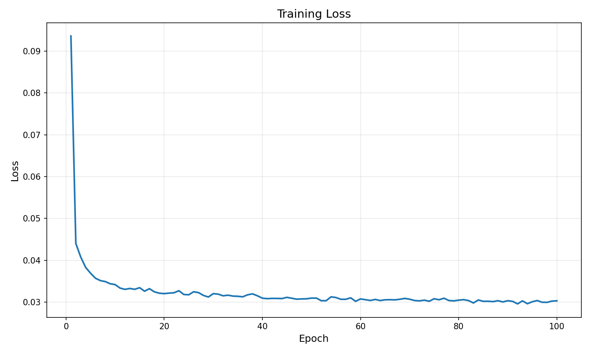
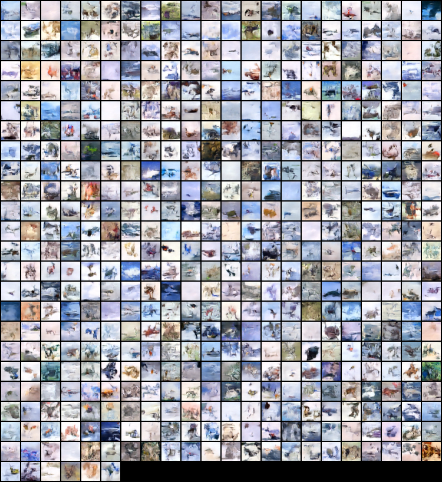
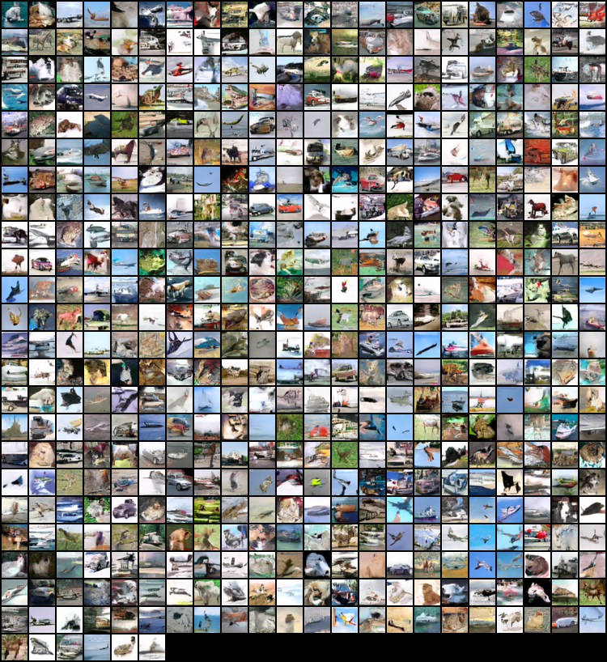
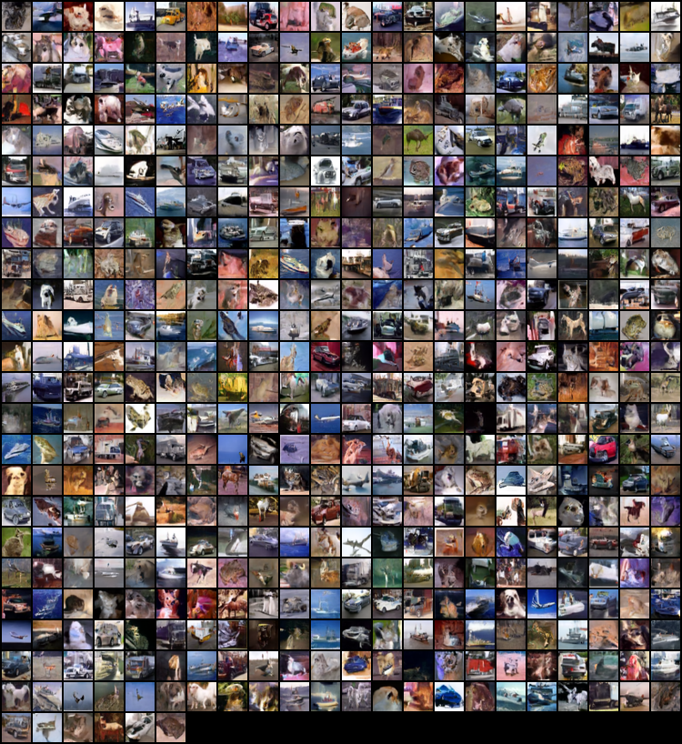

# DDPM: Denoising Diffusion Probabilistic Models on CIFAR-10

A clean, beginner-friendly implementation of Denoising Diffusion Probabilistic Models (DDPM) in PyTorch, trained on CIFAR-10. This project is designed to be easy to understand while maintaining GitHub-quality code standards.

## ✅ Results

Trained for 100 epochs (default config: 1000 timesteps, linear beta schedule, batch size 128, ~26M-parameter U-Net) on a single NVIDIA RTX A6000, ~3 hours total.

**Forward diffusion process** — a real CIFAR-10 image progressively noised to t=999:



**Training loss** (MSE between predicted and true noise) — converges from ~0.094 to ~0.030 and plateaus:



**Generated samples over training** — unconditional generation from pure noise via the full 1000-step reverse process:

| Epoch 5 | Epoch 50 | Epoch 100 |
|---|---|---|
|  |  |  |

By epoch 50, generated images already show recognizable CIFAR-10 structure (cars, horses, boats, birds, distinct color/shape coherence), holding steady through epoch 100. Final loss: 0.0303 (best checkpoint: 0.0296).

Samples are still blurry and CIFAR-10 is a genuinely hard 32×32 unconditional-generation target for a model this size trained this briefly — see the **Future Improvements** section below (EMA, more epochs, FID evaluation) for the natural next steps to sharpen this further.

## 📖 What are Diffusion Models?

Diffusion models are a class of generative models that generate images by reversing a noise corruption process. They work in two phases:

### 1. **Forward Diffusion Process** (Corruption)
- Takes a clean image and gradually adds Gaussian noise over 1000 steps
- Each step adds a small amount of noise
- After 1000 steps, the image becomes pure noise
- This process is deterministic and can be computed directly

```
Clean Image → Slightly Noisy → More Noisy → ... → Pure Noise
   (x₀)         (x₁)            (x₅₀₀)         (x₁₀₀₀)
```

### 2. **Reverse Diffusion Process** (Denoising)
- Learns to reverse the forward process
- Takes pure noise and gradually removes it step by step
- Each step is guided by a neural network (U-Net) that predicts the noise
- After 1000 steps of denoising, we get a clean, new image

```
Pure Noise → Slightly Denoised → More Clear → ... → Generated Image
  (x₁₀₀₀)        (x₉₉₉)          (x₅₀₀)         (x₀)
```

### Why It Works

The key insight is that the model learns to **predict noise** at each denoising step. During training:
1. We take a clean image from the dataset
2. We corrupt it by adding noise at a random timestep
3. We ask the U-Net to predict what noise was added
4. We compute the loss as the difference between predicted and actual noise
5. We backpropagate to improve the model

Once trained, the model can generate completely new images by starting from random noise!

## 🏗️ Project Structure

```
cifar10-ddpm/
├── configs/
│   ├── config.py              # Configuration classes and utilities
│   ├── default.yaml           # Default hyperparameters
│   └── __init__.py
├── src/
│   ├── dataset.py             # CIFAR-10 data loading and preprocessing
│   ├── diffusion.py           # Diffusion process implementation
│   ├── model.py               # U-Net architecture
│   ├── train.py               # Training script
│   ├── sample.py              # Sampling/generation script
│   ├── utils.py               # Utilities and visualization
│   └── __init__.py
├── tests/
│   └── test_diffusion.py     # Smoke/regression tests for the diffusion math and model
├── assets/                    # Real generated images embedded in this README
├── results/                   # Generated at runtime (gitignored)
│   ├── checkpoints/          # Saved model checkpoints
│   ├── samples/              # Generated sample images
│   └── plots/                # Training curves and visualizations
├── Dockerfile                 # Docker configuration
├── docker-compose.yml         # Docker Compose configuration
├── requirements.txt           # Python dependencies
├── requirements-dev.txt       # Adds pytest for running tests/
├── .dockerignore              # Files to ignore in Docker
├── .gitignore                 # Files to ignore in Git
└── README.md                  # This file
```

## 📋 Key Components Explained

### 1. **Diffusion Process** (`src/diffusion.py`)
- **Forward Process**: Adds noise to images (training)
- **Reverse Process**: Removes noise to generate images (inference)
- **Schedules**: Linear or cosine noise schedules

### 2. **U-Net Model** (`src/model.py`)
- Small U-Net suitable for 32×32 CIFAR-10 images
- Features: residual blocks, attention mechanisms, timestep embeddings
- ~26M parameters with the default config — fast training and inference

### 3. **Dataset** (`src/dataset.py`)
- Loads CIFAR-10 from torchvision
- Normalizes images to [-1, 1]
- Batch loading with configurable workers

### 4. **Training** (`src/train.py`)
- Trains the U-Net to predict noise
- Saves checkpoints regularly
- Generates sample images during training
- Plots training loss

### 5. **Sampling** (`src/sample.py`)
- Generates new images from a trained model
- Creates image grids
- Optionally saves the denoising process as a GIF

### 6. **Configuration** (`configs/config.py`)
- Centralized hyperparameter management
- YAML-based configuration loading
- Easy to reproduce results

## 🚀 Quick Start

### Without Docker

#### 1. **Clone and Setup**
```bash
git clone <repo-url>
cd Image-generation-with-ddpm
pip install -r requirements.txt
```

#### 2. **Train the Model**
```bash
python src/train.py --config configs/default.yaml
```

This will:
- Download CIFAR-10 automatically
- Train for 100 epochs (configurable)
- Save checkpoints every 10 epochs
- Generate sample images every 5 epochs
- Save training curves and visualizations

**First run takes ~5-10 minutes to download CIFAR-10, then training depends on your hardware**

#### 3. **Generate Samples**
```bash
python src/sample.py \
    --checkpoint results/checkpoints/best.pt \
    --num_samples 64
```

This generates 64 new CIFAR-like images from a trained model.

#### 4. **View Results**
```bash
# Training loss curve
open results/plots/training_loss.png

# Generated samples
open results/samples/samples.png

# Sample images from specific epoch
open results/samples/samples_epoch_50.png
```

#### 5. **Run Tests**
```bash
pip install -r requirements-dev.txt
pytest tests/ -v
```
Smoke/regression tests for the diffusion forward/reverse process and U-Net forward pass — no GPU or dataset download required.

### With Docker

#### 1. **Build and Run Training**
```bash
docker compose up --build
```

This will:
- Build the Docker image
- Mount your source code
- Run training inside the container
- Save all outputs to `results/`

#### 2. **Run Sampling with Docker**
```bash
docker compose run --rm ddpm-sample
```

#### 3. **Use GPU (if available)**
Uncomment the GPU section in `docker-compose.yml` and install [nvidia-docker](https://github.com/NVIDIA/nvidia-docker):

```bash
# Install nvidia-docker first
docker compose up --build
```

## ⚙️ Configuration

Edit `configs/default.yaml` to change hyperparameters:

```yaml
# Data
data:
  batch_size: 128      # Larger = faster training but more memory
  image_size: 32       # CIFAR-10 is 32x32
  
# Model
model:
  model_channels: 128  # Base channels (increase for more capacity)
  channel_mult: [1, 2, 2, 2]  # Channels at each resolution
  num_res_blocks: 2    # Residual blocks per level
  
# Diffusion
diffusion:
  num_timesteps: 1000  # T (more steps = better quality but slower)
  beta_schedule: "linear"  # or "cosine"
  
# Training
training:
  num_epochs: 100      # Increase for better quality
  learning_rate: 0.0001
  save_interval: 10    # Save checkpoint every N epochs
  sample_interval: 5   # Generate samples every N epochs
```

## 📊 Training Monitoring

During training, you'll see (actual output from a real 100-epoch run):

```
Epoch 1/100 - Loss: 0.093633
Epoch 2/100 - Loss: 0.043995
Epoch 3/100 - Loss: 0.040757
...
Epoch 99/100 - Loss: 0.030216
Epoch 100/100 - Loss: 0.030290

Training completed!
Best loss: 0.029555
Checkpoints saved to: results/checkpoints
Samples saved to: results/samples
Plots saved to: results/plots
```

### Generated Artifacts

- **`results/checkpoints/best.pt`**: Best model checkpoint
- **`results/checkpoints/epoch_*.pt`**: Periodic checkpoints
- **`results/samples/samples_epoch_*.png`**: Generated images at each sample interval
- **`results/plots/training_loss.png`**: Training loss curve
- **`results/plots/diffusion_process.png`**: Visualization of forward diffusion

## 🎯 Expected Results

Verified on this repo (see [Results](#-results) above): 100 epochs on a single **RTX A6000** took **~3 hours** and reached a **final loss of 0.0303** (best: 0.0296), with recognizable CIFAR-10 structure emerging by epoch 50. Training time on other GPUs will scale roughly with their throughput relative to an A6000 — expect it to take noticeably longer on older/consumer cards (e.g. RTX 3060-class) and faster on newer datacenter GPUs (A100/H100-class), but we haven't benchmarked those directly.

### Example Generated Images
Generated samples resemble CIFAR-10 classes (airplanes, cars, horses, boats, etc.) but are novel images not in the training set — see the sample grids in the [Results](#-results) section above.

## 📈 Advanced Usage

### Resume from Checkpoint
```bash
python src/train.py \
    --config configs/default.yaml \
    # Modify config to set resume_checkpoint
```

### Custom Configuration
Create a new config file:
```bash
cp configs/default.yaml configs/custom.yaml
# Edit configs/custom.yaml
python src/train.py --config configs/custom.yaml
```

### Enable Tensorboard (optional)
The code supports Tensorboard logging. Add to your config and run:
```bash
tensorboard --logdir results/
```

### Generate More Samples
```bash
python src/sample.py \
    --checkpoint results/checkpoints/best.pt \
    --num_samples 256 \
    --save_gif
```

## 🔬 Understanding the Code

### Forward Pass (Training)
```python
# 1. Get batch of clean images from dataset
x_0 = next(iter(train_loader))  # Shape: (batch_size, 3, 32, 32)

# 2. Sample random timesteps for each image
t = torch.randint(0, 1000, (batch_size,))

# 3. Add noise (forward diffusion)
x_t, noise = diffusion.q_sample(x_0, t)

# 4. Predict noise with U-Net
pred_noise = model(x_t, t)

# 5. Compute loss
loss = MSE(pred_noise, noise)

# 6. Backprop
loss.backward()
optimizer.step()
```

### Reverse Pass (Generation)
```python
# 1. Start with pure noise
x_1000 = torch.randn(batch_size, 3, 32, 32)

# 2. Iteratively denoise
for t in range(999, 0, -1):
    # Predict noise at current step
    pred_noise = model(x_t, t)
    
    # Compute x_{t-1}
    x_t = denoise_step(x_t, pred_noise, t)

# 3. Final image (x_0)
generated_image = x_0
```

## 🐛 Troubleshooting

### Out of Memory (OOM)
- Reduce `batch_size` in config
- Reduce `model_channels`
- Use `gradient_checkpointing` (not implemented, but mentioned for reference)

### Slow Training
- Use GPU (`device: cuda` in config)
- Increase `num_workers` in dataset config
- Reduce `num_timesteps` for faster iteration

### Poor Quality Generation
- Train for more epochs
- Increase `model_channels`
- Try `cosine` beta schedule
- Increase `num_timesteps`

### CUDA Out of Memory with Docker
Edit `docker-compose.yml` and reduce batch size

## 📚 References

- [DDPM Paper](https://arxiv.org/abs/2006.11239)
- [Improved DDPM](https://arxiv.org/abs/2102.09672)
- [Denoising Diffusion Models](https://arxiv.org/abs/2301.10972)

## 🎓 Learning Resources

This code is designed to be educational. Key concepts:

1. **Noise Schedules**: How to schedule beta values for linear or cosine growth
2. **U-Net Architecture**: Building blocks (residual, attention, skip connections)
3. **Timestep Embeddings**: Sinusoidal embeddings for conditioning
4. **Diffusion Math**: Reparameterization trick, Gaussian distributions
5. **Image Generation**: Sampling from complex distributions

## 💡 Future Improvements

- [ ] Implement classifier-free guidance for better generation
- [ ] Add FID/Inception Score evaluation
- [ ] Implement DDIM sampling (faster generation)
- [ ] Multi-GPU training support
- [ ] Checkpoint resumption with LR scheduler
- [ ] Experiment with different beta schedules
- [ ] Add conditional generation (class labels)
- [ ] Implement EMA (Exponential Moving Average) for model

## 📝 License

MIT License - Feel free to use this for learning and projects!

## 🤝 Contributing

Contributions welcome! Areas for improvement:
- Code optimization
- Better documentation
- Additional configurations
- Bug fixes

## 📧 Questions?

If you have questions about the code or concepts:
1. Check the docstrings in each module
2. Review the configuration options
3. Look at the referenced papers
4. Open an issue on GitHub

---

**Happy Diffusing!** 🎨✨
